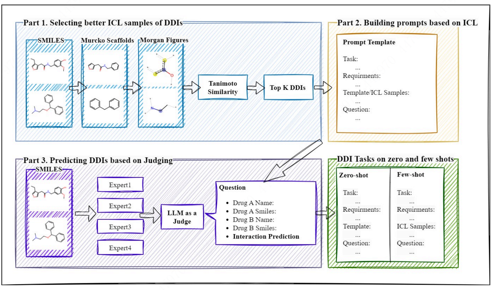
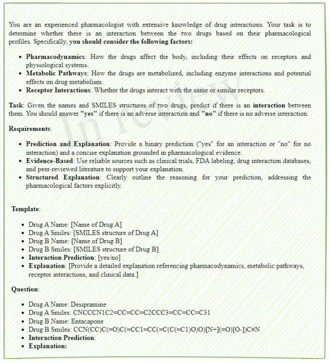
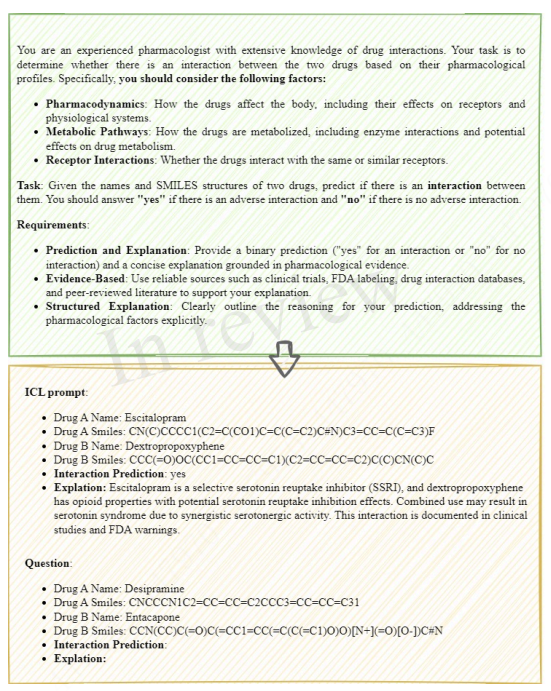

# ddi-judge

The official repository of **"Using large language models enhancing by judging and in-context learning for drug-drug interactions prediction"**. 

## 📌 Prompt
The followings are our prompt used in the paper.
### Zero-shot Prompt 

### ICL Prompt

